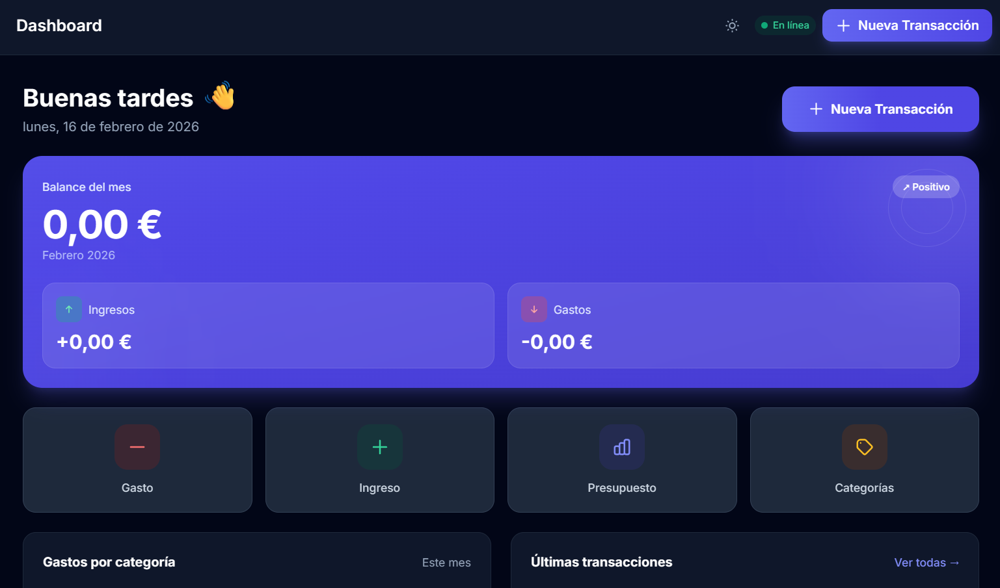
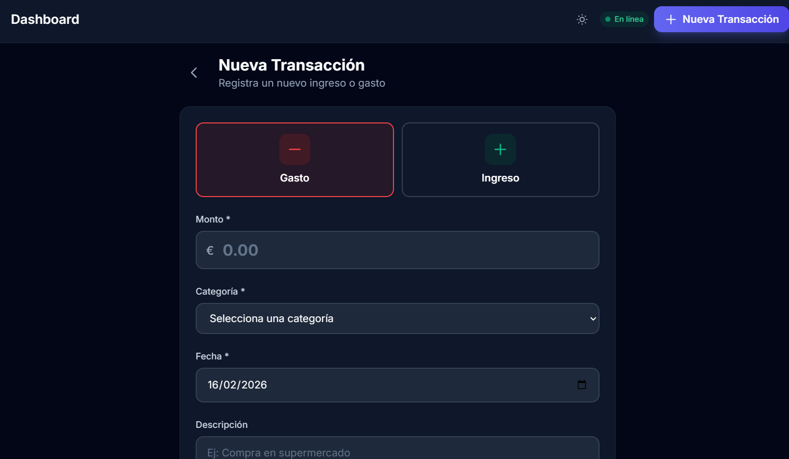
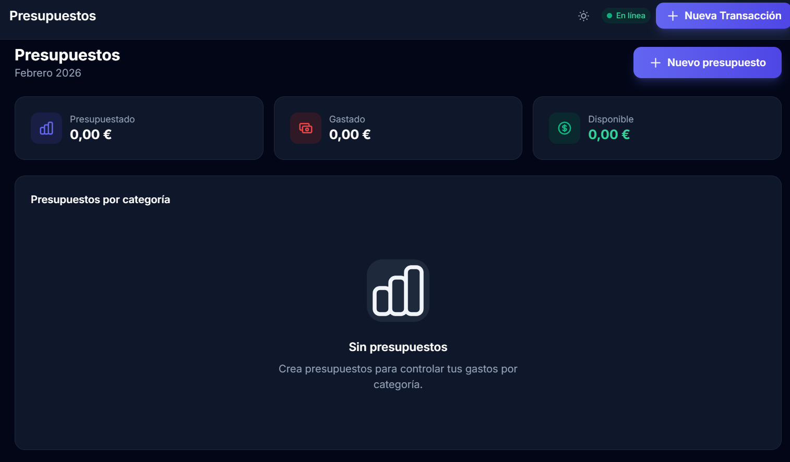
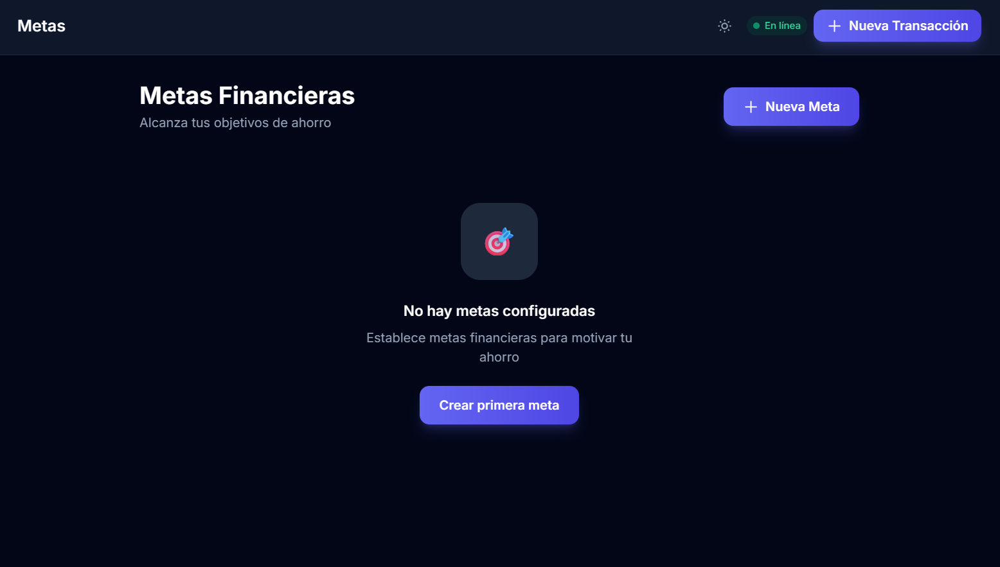

# FinanzaPro - Documentación Técnica y Memoria del Proyecto

**Autor:** Adrián
**Fecha:** 16 de Febrero de 2026
**Versión:** 1.0.0

---

## 1. Introducción

FinanzaPro es una aplicación de gestión financiera personal diseñada para ser multiplataforma (Web y Android), rápida y capaz de funcionar sin conexión a internet. El objetivo principal del proyecto es ofrecer una herramienta profesional para el seguimiento de gastos, ingresos, presupuestos y metas financieras, garantizando la privacidad y la disponibilidad de los datos en todo momento.

A diferencia de las aplicaciones web tradicionales que dependen constantemente de una conexión al servidor, FinanzaPro implementa una arquitectura **Offline-First**, priorizando la experiencia del usuario y la inmediatez de la interfaz.

---

## 2. Stack Tecnológico y Decisiones de Diseño

Para el desarrollo de FinanzaPro se han seleccionado tecnologías modernas, robustas y eficientes. A continuación se detalla la elección de cada una:

### 2.1. Frontend
*   **Lenguaje:** **JavaScript (Vanilla JS ES6+)**.
    *   *Motivo:* Se decidió no utilizar frameworks pesados como React o Angular para mantener el bundle final lo más ligero posible y tener un control total sobre el ciclo de vida de la aplicación y el DOM. Esto reduce la sobrecarga de procesamiento en dispositivos móviles de gama media/baja.
*   **Empaquetador:** **Vite**.
    *   *Motivo:* Vite ofrece tiempos de arranque de servidor de desarrollo instantáneos y builds de producción optimizados. Su soporte nativo para ES Modules simplifica enormemente la configuración.
*   **Estilos:** **TailwindCSS**.
    *   *Motivo:* Permite un desarrollo rápido de interfaces consistentes y responsivas sin salir del HTML. Al compilarse, elimina el CSS no utilizado, resultando en hojas de estilo minúsculas.

### 2.2. Backend y Datos
*   **Backend-as-a-Service (BaaS):** **Supabase**.
    *   *Motivo:* Provee una base de datos PostgreSQL completa, autenticación segura y almacenamiento de archivos sin necesidad de mantener un servidor backend dedicado. Su API en tiempo real y SDK de JavaScript facilitan la sincronización.
*   **Base de Datos Local:** **Dexie.js (Wrapper de IndexedDB)**.
    *   *Motivo:* IndexedDB es la base de datos nativa del navegador, pero su API es compleja. Dexie simplifica las consultas y permite almacenar grandes cantidades de datos estructurados directamente en el dispositivo del usuario, permitiendo el funcionamiento offline.

### 2.3. Móvil y Despliegue
*   **Motor Híbrido:** **Capacitor**.
    *   *Motivo:* Permite encapsular la aplicación web en un contenedor nativo de Android, accediendo a APIs del dispositivo si es necesario, manteniendo una única base de código para Web y Móvil.
*   **Hosting:** **GitHub Pages / Netlify**.
    *   *Motivo:* Al ser una SPA (Single Page Application) estática, puede alojarse en cualquier servidor estático sin coste.

---

## 3. Arquitectura del Sistema: Offline-First

La característica técnica más destacada de FinanzaPro es su arquitectura de datos.

### 3.1. Flujo de Datos Híbrido
El sistema utiliza un patrón de **"Lectura Local, Sincronización en Segundo Plano"**:

1.  **Lectura Instantánea:** Cuando el usuario abre la app, los datos se cargan inmediatamente desde **Dexie.js (Local)**. No hay "spinners" de carga esperando a la red.
2.  **Escritura Optimista:** Al guardar una transacción, se guarda inmediatamente en Dexie y la UI se actualiza.
3.  **Cola de Sincronización:** La operación (INSERT, UPDATE, DELETE) se añade a una cola interna (`syncQueue`).
4.  **Sync Background:** El servicio `DataManager` detecta si hay conexión. Si la hay, procesa la cola y envía los cambios a **Supabase**. Si no, espera hasta que vuelva la conexión.

> **Diagrama Conceptual:**
> UI <--> [Dexie.js (Local)] <--> [Sync Manager] <--> (Internet) <--> [Supabase (Nube)]

### 3.2. Router Hash Personalizado
Para garantizar la compatibilidad con el sistema de archivos de Android (`file:///android_asset/...`) donde no existe un servidor web real que maneje rutas limpias, se implementó un **Hash Router** personalizado en `src/router/index.js`.

*   Las rutas funcionan mediante el fragmento de la URL: `index.html#/transacciones`.
*   Esto evita errores 404 al recargar la página en entornos estáticos o móviles.

---

## 4. Estructura del Proyecto

El código fuente se encuentra en la carpeta `src/` y sigue una estructura modular:

```text
src/
├── components/     # Componentes UI reutilizables (Layout, Cards, Modales)
├── router/         # Lógica de navegación (Hash Router)
├── services/       # Capa de datos y lógica de negocio
│   ├── supabase.js    # Cliente API Remoto
│   ├── dexie.js       # Cliente Base de Datos Local
│   └── dataManager.js # Orquestador de Sincronización (Cerebro de la App)
├── styles/         # Configuración de Tailwind y CSS global
├── utils/          # Utilidades (Formateadores de moneda, fechas, i18n)
├── views/          # Vistas principales (Páginas)
│   ├── Dashboard.js
│   ├── Transacciones.js
│   ├── ...
└── main.js         # Punto de entrada y configuración global
```

---

## 5. Detalles de Implementación Clave

### 5.1. DataManager (`src/services/dataManager.js`)
Es el servicio más crítico. Centraliza todas las peticiones de datos. Las vistas nunca llaman a Supabase directamente para leer datos; siempre piden los datos a `dataManager`, que decide si devolver la versión local y cuándo sincronizar.

### 5.2. Autenticación
Se utiliza **Supabase Auth**. El estado de la sesión persiste en `localStorage`.
*   Al iniciar, se verifica la sesión.
*   Si hay usuario: Se descarga una copia inicial de sus datos de Supabase a Dexie (si es la primera vez).
*   Si no hay usuario: Se redirige al Login.

### 5.3. Seguridad (Row Level Security)
En Supabase (PostgreSQL), se han configurado políticas RLS (Row Level Security).
*   **Regla:** Un usuario solo puede ver, editar o borrar filas donde `user_id` coincida con su UID autenticado.
*   Esto garantiza que, aunque alguien intente acceder a la API directamente, nunca podrá ver datos de otros usuarios.

---

## 6. Base de Datos (Esquema Unificado)

Tanto en local (Dexie) como en remoto (Supabase), se mantiene la misma estructura para facilitar el mapeo.

**Tablas Principales:**

1.  **`profiles`**: Información del usuario.
2.  **`categories`**:
    *   `id`: UUID
    *   `nombre`: String
    *   `tipo`: 'ingreso' | 'gasto'
    *   `icon`, `color`: Estética
3.  **`transactions`**:
    *   `id`: UUID
    *   `monto`: Decimal
    *   `tipo`: 'ingreso' | 'gasto'
    *   `category_id`: FK -> categories.id
    *   `fecha`: Date
    *   `archivo_url`: String (URL de imagen de recibo)
4.  **`budgets`**: Presupuestos mensuales por categoría.
5.  **`goals`**: Metas de ahorro.

---

## 7. Guía de Funcionalidades y Uso

A continuación se muestra el flujo de uso de la aplicación.

### 7.1. Dashboard Principal
El panel de control ofrece una visión rápida del estado financiero del mes actual.



**Funcionamiento:** Los datos se calculan en tiempo real sumando las transacciones almacenadas localmente en Dexie.js.

### 7.2. Gestión de Transacciones
Permite registrar nuevos movimientos. Soporta adjuntar imágenes de recibos/facturas.



**Detalle Técnico:** La imagen se sube a Supabase Storage inmediatamente si hay internet. Si no, la transacción se guarda sin imagen o se pone en cola (dependiendo de la lógica de red), garantizando que no se pierda el apunte contable.

### 7.3. Presupuestos y Metas
El usuario puede definir límites de gasto por categoría y objetivos de ahorro.




---

## 8. Guía de Instalación y Despliegue

### 8.1. Requisitos Previos
*   Node.js v18 o superior.
*   NPM (viene con Node).

### 8.2. Instalación Local
```bash
# 1. Clonar el repositorio
git clone <url-del-repo>

# 2. Instalar dependencias
npm install

# 3. Configurar variables de entorno
# Crear archivo .env basado en .env.example y añadir credenciales de Supabase
cp .env.example .env

# 4. Iniciar servidor de desarrollo
npm run dev
```

### 8.3. Compilación para Producción (Web)
```bash
npm run build
# Los archivos generados estarán en la carpeta /dist
```

### 8.4. Compilación para Android (APK)
```bash
# Sincronizar proyecto web con carpeta nativa
npx cap sync

# Abrir Android Studio para compilar
npx cap open android
```

---

## 9. Conclusión y Futuras Mejoras

FinanzaPro cumple con éxito el objetivo de ser una aplicación financiera personal robusta y privada. La arquitectura elegida permite una escalabilidad excelente y una experiencia de usuario superior gracias a su velocidad.

**Próximos pasos:**
*   Implementar modo oscuro automático según sistema.
*   Añadir exportación a PDF de informes mensuales.
*   Integración con APIs bancarias (Open Banking) en futuras versiones.

---
*Fin del documento técnico.*
