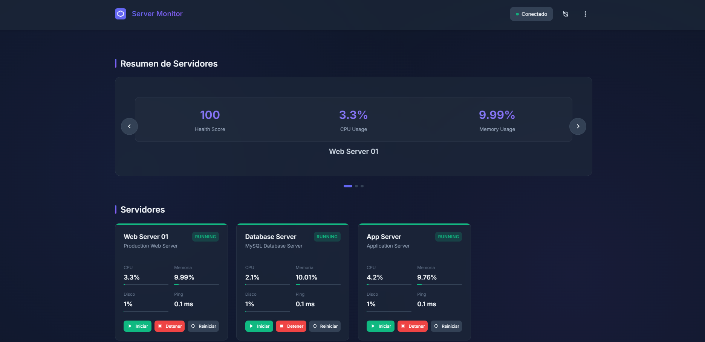
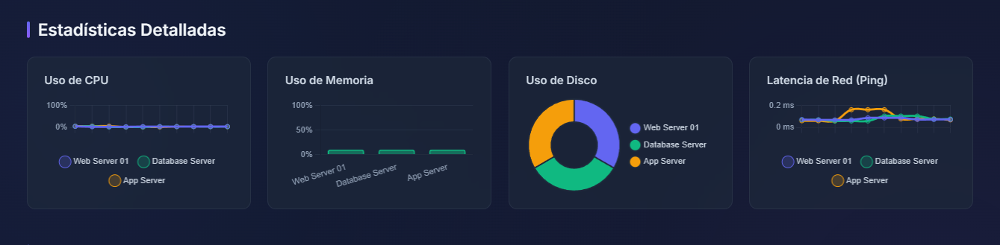
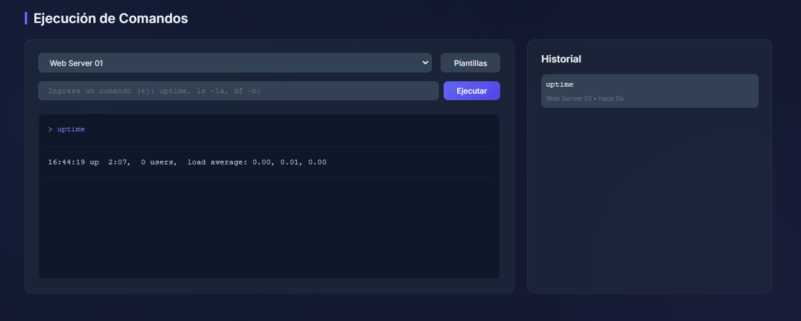

# 📚 Documentación Técnica Completa
## Server Monitoring Dashboard

---

## 📋 Índice

1. [Introducción](#introducción)
2. [Decisiones Técnicas](#decisiones-técnicas)
3. [Arquitectura del Sistema](#arquitectura-del-sistema)
4. [Backend - Node.js](#backend---nodejs)
5. [Frontend - Vanilla JavaScript](#frontend---vanilla-javascript)
6. [Capturas del Dashboard](#capturas-del-dashboard)

---

## 🎯 Introducción

Este proyecto es un **sistema profesional de monitorización de servidores en tiempo real** que permite:

- ✅ Monitorizar múltiples servidores simultáneamente
- ✅ Controlar contenedores Docker (Start/Stop/Restart)
- ✅ Ejecutar comandos SSH remotos
- ✅ Visualizar estadísticas con gráficos interactivos
- ✅ Recibir alertas basadas en umbrales configurables
- ✅ Interfaz responsive (móvil, tablet, desktop)

**Objetivo**: Proporcionar una solución completa, profesional y autónoma que no requiera configuración manual.

---

## 🔧 Decisiones Técnicas

### ¿Por qué Node.js para el Backend?

**Razones principales**:

1. **SSH2 Library**: Node.js tiene `ssh2`, una librería robusta para conexiones SSH
   - Permite ejecutar comandos remotos
   - Pool de conexiones reutilizables
   - Manejo eficiente de múltiples servidores

2. **WebSocket nativo**: Módulo `ws` para comunicación bidireccional en tiempo real
   - Actualizaciones automáticas sin polling
   - Bajo overhead de red
   - Conexión persistente

3. **Docker API**: `dockerode` para control de contenedores
   - Start/Stop/Restart programático
   - Monitoreo de recursos de contenedores
   - Acceso al socket de Docker

4. **JavaScript Full-Stack**: Mismo lenguaje en backend y frontend
   - Código reutilizable
   - Formato JSON nativo
   - Ecosistema npm extenso

5. **Event-Driven Architecture**: Node.js es ideal para operaciones I/O intensivas
   - Monitoreo continuo sin bloqueo
   - Múltiples conexiones simultáneas
   - Escalabilidad horizontal

### ¿Por qué Vanilla JavaScript en el Frontend?

**Razones principales**:

1. **Sin dependencias de frameworks**: Más ligero y rápido
   - No requiere bundle complejons
   - Carga inicial más rápida
   - Menos problemas de compatibilidad

2. **Control total**: Manipulación directa del DOM
   - Animaciones CSS personalizadas
   - Optimización performance específica
   - Código más predecible

3. **Aprendizaje profundo**: Demuestra dominio de JavaScript puro
   - Patrones de diseño modulares
   - Event delegation
   - Arquitectura de componentes sin framework

4. **Flexibilidad**: Chart.js es la única dependencia externa
   - Librería madura y estable
   - Fácil personalización
   - Documentación extensa

### ¿Por qué Docker?

1. **Portabilidad**: Funciona igual en cualquier sistema
2. **Aislamiento**: Cada servicio en su contenedor
3. **Automatización**: Setup completo con un comando
4. **Red compartida**: Comunicación automática entre contenedores
5. **Producción-ready**: Fácil despliegue a servidores

---

## 🏗️ Arquitectura del Sistema

### Flujo de Comunicación

1. **Frontend → Backend (HTTP)**:
   - API REST para operaciones CRUD
   - Control de servidores (start/stop)
   - Ejecución de comandos
   
2. **Backend → Frontend (WebSocket)**:
   - Push de estadísticas cada 5s
   - Push de ping cada 10s
   - Alertas en tiempo real

3. **Backend → Servidores (SSH)**:
   - Ejecución de comandos
   - Recolección de stats (CPU, RAM, Disk)
   
4. **Backend → Docker (API)**:
   - Control de contenedores
   - Monitoreo de recursos

---

## 💻 Backend - Node.js

### Estructura de Archivos

```
backend/
├── server.js              # Punto de entrada
├── config.js              # Configuración central
├── ssh-manager.js         # Gestión SSH
├── docker-manager.js      # Control Docker
├── stats-collector.js     # Recolección stats
├── ping-service.js        # Servicio ping
├── websocket-handler.js   # WebSocket
└── routes/
    ├── servers.js         # API servidores
    ├── commands.js        # API comandos
    └── monitoring.js      # API monitoreo
```

### 1. Servidor Principal (`server.js`)

**Propósito**: Inicializar todos los servicios y coordinar el sistema.

```javascript
const express = require('express');
const http = require('http');
const config = require('./config');
const websocketHandler = require('./websocket-handler');
const statsCollector = require('./stats-collector');
const pingService = require('./ping-service');

const app = express();

// Middleware
app.use(cors());
app.use(express.json());
app.use(express.static(path.join(__dirname, '../frontend')));

// API Routes
app.use('/api/servers', serversRouter);
app.use('/api/commands', commandsRouter);
app.use('/api/monitoring', monitoringRouter);

// Create servers
const server = http.createServer(app);
const wsServer = http.createServer();
websocketHandler.initialize(wsServer);
```

**Decisiones clave**:
- ✅ **Separación HTTP/WebSocket**: Dos servidores independientes para mejor control
- ✅ **Static files**: Express sirve el frontend directamente
- ✅ **Middleware chain**: CORS → JSON → Static → Routes

### 2. SSH Manager (`ssh-manager.js`)

**Propósito**: Gestionar conexiones SSH y ejecutar comandos remotos.

```javascript
const { Client } = require('ssh2');

class SSHManager {
  async executeCommand(server, command) {
    return new Promise((resolve, reject) => {
      const conn = new Client();
      let output = '';

      conn.on('ready', () => {
        conn.exec(command, (err, stream) => {
          if (err) return reject(err);

          stream.on('data', (data) => {
            output += data.toString();
          });

          stream.on('close', (code) => {
            conn.end();
            resolve({
              success: code === 0,
              output: output.trim(),
              code
            });
          });
        });
      });

      conn.connect({
        host: server.hostname,
        port: 22,
        username: config.ssh.username,
        password: config.ssh.password
      });
    });
  }

  async getSystemStats(server) {
    const [cpu, memory, disk, network] = await Promise.all([
      this.getCPUStats(server),
      this.getMemoryStats(server),
      this.getDiskStats(server),
      this.getNetworkStats(server)
    ]);

    return { cpu, memory, disk, network };
  }
}
```

**Decisiones clave**:
- ✅ **Promises**: Envolver callbacks SSH en Promises para async/await
- ✅ **Parallel execution**: `Promise.all` para múltiples stats simultáneas
- ✅ **Error handling**: Try/catch con fallbacks

**Recolección de CPU**:

```javascript
async getCPUStats(server) {
  // Comando: top -bn1 para snapshot de CPU
  const command = `top -bn1 | grep "Cpu(s)" | awk '{print $2}'`;
  const result = await this.executeCommand(server, command);
  const cpuUsage = parseFloat(result.output) || 0;
  
  // Load averages
  const loadCommand = `uptime | awk -F'load average:' '{print $2}'`;
  const loadResult = await this.executeCommand(server, loadCommand);
  const [load1, load5, load15] = loadResult.output
    .split(',')
    .map(l => parseFloat(l.trim()));

  return { usage: cpuUsage, load1, load5, load15 };
}
```

**¿Por qué este approach?**:
- `top -bn1`: Modo batch, una iteración (rápido)
- `awk`: Parsing eficiente en servidor
- Parse en backend: Validación y formato JSON

### 3. Docker Manager (`docker-manager.js`)

**Propósito**: Controlar contenedores Docker mediante API.

```javascript
const Docker = require('dockerode');

class DockerManager {
  constructor() {
    // Socket path diferente en Windows vs Linux
    this.docker = new Docker({
      socketPath: process.platform === 'win32' 
        ? '//./pipe/docker_engine' 
        : '/var/run/docker.sock'
    });
  }

  async startContainer(containerName) {
    const container = this.docker.getContainer(containerName);
    await container.start();
    return { success: true };
  }

  async getContainerStats(containerName) {
    const container = this.docker.getContainer(containerName);
    const stats = await container.stats({ stream: false });

    // Calcular CPU %
    const cpuDelta = stats.cpu_stats.cpu_usage.total_usage - 
                     stats.precpu_stats.cpu_usage.total_usage;
    const systemDelta = stats.cpu_stats.system_cpu_usage - 
                        stats.precpu_stats.system_cpu_usage;
    const cpuPercent = (cpuDelta / systemDelta) * 
                       stats.cpu_stats.online_cpus * 100;

    return { cpu: cpuPercent.toFixed(2) };
  }
}
```

**Decisiones clave**:
- ✅ **Cross-platform**: Detecta Windows vs Linux para socket path
- ✅ **Stream: false**: Stats instantáneas, no streaming
- ✅ **CPU calculation**: Algoritmo estándar de Docker para % CPU

### 4. Stats Collector (`stats-collector.js`)

**Propósito**: Recolectar, cachear y calcular health score.

```javascript
class StatsCollector {
  constructor() {
    this.statsCache = new Map();
    this.statsHistory = new Map();
  }

  calculateHealthScore(stats, ping) {
    let score = 100;
    const thresholds = config.thresholds;

    // CPU penalty
    if (stats.cpu.usage > thresholds.cpu.critical) score -= 30;
    else if (stats.cpu.usage > thresholds.cpu.warning) score -= 15;

    // Memory penalty
    if (stats.memory.usedPercent > thresholds.memory.critical) score -= 30;
    else if (stats.memory.usedPercent > thresholds.memory.warning) score -= 15;

    // Disk penalty
    if (stats.disk.usedPercent > thresholds.disk.critical) score -= 20;
    else if (stats.disk.usedPercent > thresholds.disk.warning) score -= 10;

    // Ping penalty
    if (!ping.alive) score -= 50;
    else if (ping.time > thresholds.ping.critical) score -= 10;

    return Math.max(0, score);
  }
}
```

**Algoritmo Health Score**:
- Base: 100 puntos
- Penalizaciones acumulativas
- Resultado: 0-100

**¿Por qué este sistema?**:
- Simple de entender
- Configurable (thresholds)
- Refleja múltiples métricas

### 5. WebSocket Handler (`websocket-handler.js`)

**Propósito**: Comunicación bidireccional en tiempo real.

```javascript
const WebSocket = require('ws');

class WebSocketHandler {
  initialize(server) {
    this.wss = new WebSocket.Server({ server });

    this.wss.on('connection', (ws) => {
      this.clients.add(ws);

      ws.on('message', (message) => {
        const data = JSON.parse(message);
        this.handleClientMessage(ws, data);
      });

      ws.on('close', () => {
        this.clients.delete(ws);
      });

      // Heartbeat
      ws.isAlive = true;
      ws.on('pong', () => { ws.isAlive = true; });
    });

    this.startHeartbeat();
  }

  broadcast(message) {
    const data = JSON.stringify(message);
    this.clients.forEach(client => {
      if (client.readyState === WebSocket.OPEN) {
        client.send(data);
      }
    });
  }

  startHeartbeat() {
    setInterval(() => {
      this.clients.forEach(ws => {
        if (!ws.isAlive) return ws.terminate();
        ws.isAlive = false;
        ws.ping();
      });
    }, 30000);
  }
}
```

**Decisiones clave**:
- ✅ **Heartbeat**: Detecta conexiones muertas cada 30s
- ✅ **Broadcast**: Envía a todos los clientes conectados
- ✅ **Event system**: Emite eventos para otros módulos

### 6. API Routes (`routes/servers.js`)

**Ejemplo de endpoint**:

```javascript
router.post('/:id/start', async (req, res) => {
  try {
    const server = config.servers.find(s => s.id === req.params.id);
    if (!server) {
      return res.status(404).json({
        success: false,
        error: 'Server not found'
      });
    }

    const result = await dockerManager.startContainer(server.container);
    res.json(result);
  } catch (error) {
    res.status(500).json({
      success: false,
      error: error.message
    });
  }
});
```

**Patrón consistente**:
1. Validar parámetros
2. Buscar servidor en config
3. Ejecutar operación
4. Manejar errores
5. Responder JSON

---

## 🎨 Frontend - Vanilla JavaScript

### Estructura Modular

```
frontend/
├── index.html
├── css/
│   ├── styles.css         # Tema y componentes
│   └── responsive.css     # Breakpoints
└── js/
    ├── app.js             # Controlador
    ├── api.js             # Cliente REST
    ├── websocket.js       # Cliente WS
    ├── dashboard.js       # UI servidores
    ├── charts.js          # Gráficos
    ├── carousel.js        # Carousel
    ├── commands.js        # Terminal
    └── utils.js           # Helpers
```

### 1. Sistema de Variables CSS

**Propósito**: Tema consistente y fácil de modificar.

```css
:root {
  /* Colors */
  --color-primary: #6366f1;
  --color-success: #10b981;
  --color-warning: #f59e0b;
  --color-danger: #ef4444;
  
  /* Backgrounds */
  --bg-primary: #0f172a;
  --bg-card: rgba(30, 41, 59, 0.6);
  
  /* Spacing */
  --spacing-sm: 0.5rem;
  --spacing-md: 1rem;
  --spacing-lg: 1.5rem;
  
  /* Transitions */
  --transition-base: 250ms ease;
}
```

**Ventajas**:
- Cambio global de colores en un lugar
- Modo oscuro / claro fácil con JS
- Consistencia automática

### 2. Glassmorphism Effect

```css
.server-card {
  background: var(--bg-card);
  backdrop-filter: blur(10px);
  border: 1px solid rgba(148, 163, 184, 0.1);
  border-radius: 12px;
  box-shadow: 0 10px 15px -3px rgba(0, 0, 0, 0.1);
}
```

**Técnicas**:
- `backdrop-filter: blur`: Efecto de vidrio esmerilado
- `rgba` con alpha: Transparencia controlada
- `box-shadow`: Profundidad 3D

### 3. Animaciones CSS

```css
@keyframes float {
  0%, 100% { transform: translateY(0); }
  50% { transform: translateY(-5px); }
}

.logo-icon {
  animation: float 3s ease-in-out infinite;
}

@keyframes pulse {
  0%, 100% { opacity: 1; }
  50% { opacity: 0.5; }
}

.status-dot {
  animation: pulse 2s ease-in-out infinite;
}
```

**¿Por qué CSS animations?**:
- GPU-accelerated (mejor performance)
- No requiere JavaScript
- Funciona incluso con JS bloqueado

### 4. Arquitectura Modular JavaScript

**Pattern: Revealing Module**

```javascript
const dashboard = {
  servers: [],
  statsData: {},

  async init() {
    await this.loadServers();
    this.render();
    this.setupEventListeners();
  },

  render() {
    const grid = document.getElementById('serversGrid');
    grid.innerHTML = '';
    this.servers.forEach(server => {
      const card = this.createServerCard(server);
      grid.appendChild(card);
    });
  },

  updateStats(stats) {
    this.statsData[stats.serverId] = stats;
    // Update DOM elements
  }
};

window.dashboard = dashboard;
```

**Ventajas**:
- Encapsulación de datos
- API pública clara
- No contamina scope global

### 5. API Cliente con Fetch

```javascript
const api = {
  baseURL: window.location.origin,

  async request(endpoint, options = {}) {
    const url = `${this.baseURL}${endpoint}`;
    const config = {
      ...options,
      headers: {
        'Content-Type': 'application/json',
        ...options.headers
      }
    };

    const response = await fetch(url, config);
    const data = await response.json();

    if (!response.ok) {
      throw new Error(data.error || 'Request failed');
    }

    return data;
  },

  async getServers() {
    return this.request('/api/servers', { method: 'GET' });
  }
};
```

**Decisiones**:
- ✅ **Wrapper centralizado**: Un lugar para manejar errores
- ✅ **Async/await**: Código más limpio que Promises
- ✅ **Throw on error**: Permite try/catch en consumidores

### 6. WebSocket con Reconexión

```javascript
const websocket = {
  ws: null,
  reconnectAttempts: 0,
  maxReconnectAttempts: 10,

  init() {
    const wsURL = `ws://${window.location.hostname}:3001`;
    this.ws = new WebSocket(wsURL);
    this.setupEventHandlers();
  },

  setupEventHandlers() {
    this.ws.onopen = () => {
      console.log('Connected');
      this.reconnectAttempts = 0;
      this.updateConnectionStatus('connected');
    };

    this.ws.onclose = () => {
      console.log('Disconnected');
      this.handleReconnect();
    };

    this.ws.onmessage = (event) => {
      const data = JSON.parse(event.data);
      this.emit(data.type, data);
    };
  },

  handleReconnect() {
    if (this.reconnectAttempts < this.maxReconnectAttempts) {
      this.reconnectAttempts++;
      setTimeout(() => this.init(), 5000);
    }
  }
};
```

**Pattern: Exponential Backoff**:
- Intento 1: 5s
- Intento 2: 5s
- Max 10 intentos
- Evita saturar servidor

### 7. Charts con Chart.js

```javascript
const charts = {
  instances: {},

  createCPUChart() {
    const ctx = document.getElementById('cpuChart');
    this.instances.cpu = new Chart(ctx, {
      type: 'line',
      data: {
        labels: [],
        datasets: []
      },
      options: {
        responsive: true,
        scales: {
          y: {
            beginAtZero: true,
            max: 100,
            ticks: {
              callback: (value) => value + '%'
            }
          }
        }
      }
    });
  },

  updateCPUChart(servers, statsData) {
    const chart = this.instances.cpu;
    
    servers.forEach((server, index) => {
      const stats = statsData[server.id];
      if (stats && stats.cpu) {
        chart.data.datasets[index].data.push(stats.cpu.usage);
        
        // Limitar a 10 puntos
        if (chart.data.datasets[index].data.length > 10) {
          chart.data.datasets[index].data.shift();
        }
      }
    });

    chart.update('none'); // Sin animación para performance
  }
};
```

**Optimizaciones**:
- `update('none')`: Sin animación (mejor FPS)
- Limitar datos a 10 puntos
- Update incremental, no recrear chart

---

## 📸 Capturas del Dashboard

### Vista Principal del Dashboard



**Elementos visibles**:
1. **Header**: Logo con gradiente, estado de conexión WebSocket
2. **Carousel**: Health Score (85), CPU (45.2%), Memory (68%)
3. **Server Grid**: 3 tarjetas con:
   - Estado (Running en verde)
   - Métricas con barras de progreso
   - Botones de control

### Sección de Gráficos



**4 Gráficos Chart.js**:
1. **CPU**: Líneas múltiples, histórico
2. **Memoria**: Barras comparativas
3. **Disco**: Dona con porcentajes
4. **Ping**: Latencia en tiempo real

### Panel de Comandos



**Componentes**:
1. **Selector de servidor**
2. **Input de comando** (monospace)
3. **Botón Execute** (gradiente indigo)
4. **Terminal** con output en verde
5. **Historial** de comandos recientes
6. **Modal de Plantillas** con categorías

---

## 🎨 Diseño y Estética

### Paleta de Colores

| Color | Hex | Uso |
|-------|-----|-----|
| Primary | `#6366f1` | Botones, enlaces, gráficos |
| Success | `#10b981` | Estados OK, Start button |
| Warning | `#f59e0b` | Alertas, umbrales |
| Danger | `#ef4444` | Errores, Stop button |
| Background | `#0f172a` | Fondo principal |
| Card BG | `rgba(30,41,59,0.6)` | Cards glassmorphism |

### Tipografía

```css
font-family: 'Inter', -apple-system, BlinkMacSystemFont, 'Segoe UI', sans-serif;
```

**Por qué Inter**:
- Diseñado para pantallas
- Excelente legibilidad
- Números tabulares (alineación)
- Gratis y open-source

### Responsive Breakpoints

```css
/* Mobile */
@media (max-width: 768px) {
  .servers-grid { grid-template-columns: 1fr; }
}

/* Tablet */
@media (max-width: 1024px) {
  .servers-grid { grid-template-columns: repeat(2, 1fr); }
}

/* Desktop */
@media (min-width: 1024px) {
  .servers-grid { grid-template-columns: repeat(3, 1fr); }
}
```

---

## 🚀 Conclusión

Este proyecto demuestra:

✅ **Arquitectura full-stack moderna**
✅ **Comunicación en tiempo real**
✅ **Control de infraestructura**
✅ **Diseño UI/UX profesional**
✅ **Código limpio y modular**
✅ **Documentación completa**

**Tecnologías dominadas**:
- Node.js + Express
- WebSocket (ws)
- SSH2
- Docker API
- Vanilla JavaScript
- Chart.js
- CSS3 (Animations, Grid, Flexbox)
- Docker + docker-compose

---

**Desarrollado con** ❤️ **usando tecnologías modernas y mejores prácticas**
